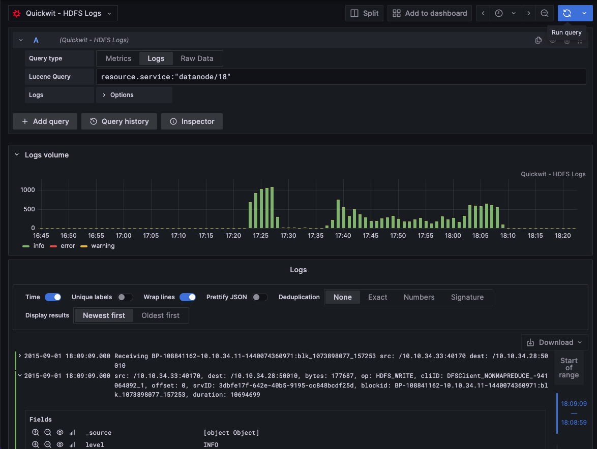
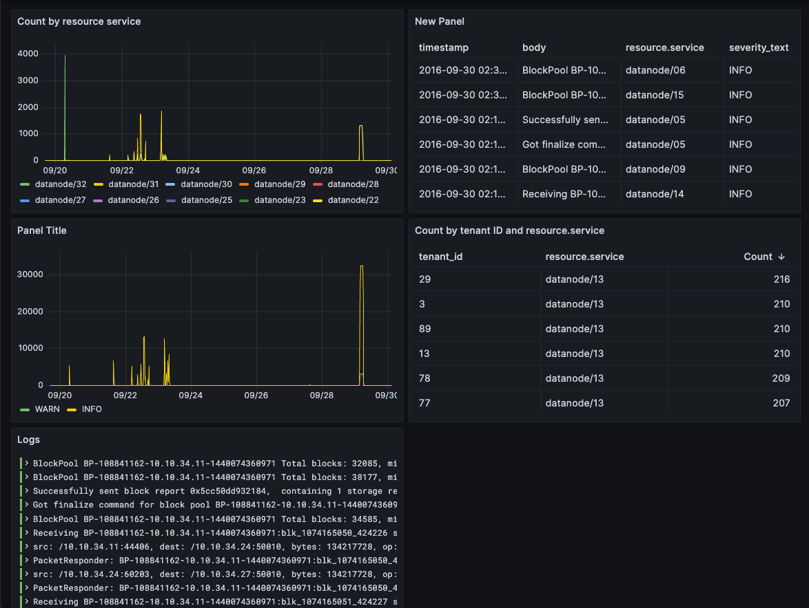

# Quickwit data source for Grafana



The Quickwit data source plugin allows you to query and visualize Quickwit data from within Grafana.

## 🎉 What's New in v0.5.0

- **Grafana 11.x Support**
- **Fixed Adhoc Filters**: Improved adhoc filters feature for dynamic query building
- **Enhanced Stability**: Various bug fixes and improvements

It is available for installation directly from the
[Grafana catalog](https://grafana.com/grafana/plugins/quickwit-quickwit-datasource/) until version 0.4.5
or you can download the latest version and follow the
[installation guide](#installation).

## Version compatibility

We recommend Grafana v10.X or v11.X.

Quickwit 0.7 is compatible with 0.3.x versions only.

Quickwit 0.8 is compatible with 0.4.x and 0.5.x versions.

- **v0.5.x** (Latest): Grafana 11.x with improved adhoc filters
- **v0.4.x**: Grafana 10.x  
- **v0.3.x**: Grafana 9.x / Quickwit 0.7

## Installation

You can either download the plugin manually and unzip it into the plugin directory or use the env variable `GF_INSTALL_PLUGINS` to install it.

### 0.5.0 (Latest) for Quickwit 0.8 + Grafana 12.1

`GF_INSTALL_PLUGINS` has been deprecated since 12.1. `GF_PLUGINS_PREINSTALL_SYNC` must be used instead

Run `grafana` container with the env variable:

```bash
docker run -p 3000:3000 -e GF_PLUGINS_PREINSTALL_SYNC="quickwit-quickwit-datasource@0.5.0@https://github.com/quickwit-oss/quickwit-datasource/releases/download/v0.5.0/quickwit-quickwit-datasource-0.5.0.zip" grafana/grafana run
```

Or download the plugin manually and start Grafana

```bash
wget https://github.com/quickwit-oss/quickwit-datasource/releases/download/v0.5.0/quickwit-quickwit-datasource-0.5.0.zip
mkdir -p plugins
unzip quickwit-quickwit-datasource-0.5.0.zip -d plugins/quickwit-quickwit-datasource-0.5.0
docker run -p 3000:3000 -e GF_PATHS_PLUGINS=/data/plugins -v ${PWD}/plugins:/data/plugins grafana/grafana run
```

### 0.5.0 (Latest) for Quickwit 0.8 + Grafana 11

Run `grafana` container with the env variable:

```bash
docker run -p 3000:3000 -e GF_INSTALL_PLUGINS="https://github.com/quickwit-oss/quickwit-datasource/releases/download/v0.5.0/quickwit-quickwit-datasource-0.5.0.zip;quickwit-quickwit-datasource" grafana/grafana run
```

Or download the plugin manually and start Grafana

```bash
wget https://github.com/quickwit-oss/quickwit-datasource/releases/download/v0.5.0/quickwit-quickwit-datasource-0.5.0.zip
mkdir -p plugins
unzip quickwit-quickwit-datasource-0.5.0.zip -d plugins/quickwit-quickwit-datasource-0.5.0
docker run -p 3000:3000 -e GF_PATHS_PLUGINS=/data/plugins -v ${PWD}/plugins:/data/plugins grafana/grafana run
```

### 0.4.6 for Quickwit 0.8 + Grafana 10

Run `grafana-oss` container with the env variable:

```bash
docker run -p 3000:3000 -e GF_INSTALL_PLUGINS="https://github.com/quickwit-oss/quickwit-datasource/releases/download/v0.4.6/quickwit-quickwit-datasource-0.4.6.zip;quickwit-quickwit-datasource" grafana/grafana-oss run
```

Or download the plugin manually and start Grafana

```bash
wget https://github.com/quickwit-oss/quickwit-datasource/releases/download/v0.4.6/quickwit-quickwit-datasource-0.4.6.zip
mkdir -p plugins
unzip quickwit-quickwit-datasource-0.4.6.zip -d plugins/quickwit-quickwit-datasource-0.4.6
docker run -p 3000:3000 -e GF_PATHS_PLUGINS=/data/plugins -v ${PWD}/plugins:/data/plugins grafana/grafana-oss run
```

### 0.3.2 for Quickwit 0.7

Run `grafana-oss` container with the env variable:

```bash
docker run -p 3000:3000 -e GF_INSTALL_PLUGINS="https://github.com/quickwit-oss/quickwit-datasource/releases/download/v0.3.2/quickwit-quickwit-datasource-0.3.2.zip;quickwit-quickwit-datasource" grafana/grafana-oss run
```

Or download the plugin manually and start Grafana

```bash
wget https://github.com/quickwit-oss/quickwit-datasource/releases/download/v0.3.2/quickwit-quickwit-datasource-0.3.2.zip
mkdir -p plugins
unzip quickwit-quickwit-datasource-0.3.2.zip -d plugins/quickwit-quickwit-datasource-0.3.2
docker run -p 3000:3000 -e GF_PATHS_PLUGINS=/data/plugins -v ${PWD}/plugins:/data/plugins grafana/grafana-oss run
```

## Additional instructions

If you are running a local Quickwit instance on Linux, add the `--network=host` argument to the `docker run` command. This will allow Grafana to access services on the host machine. You can later use `http://localhost:7280/api/v1` in the Quickwit API URL when configuring the data source.

The default username and password are `admin` and `admin`.

You're all set!

### Plugins management

For detailed instructions on how to install plugins on Grafana Cloud or
locally, please check out the [Plugin management docs](https://grafana.com/docs/grafana/latest/administration/plugin-management/).

## Configuration

To configure the Quickwit datasource, you need to provide the following information:
- The Quickwit API URL with the `/api/v1` suffix. If you have a Quickwit local instance, set the host to `http://host.docker.internal:7280/api/v1` on macOS or `http://localhost:7280/api/v1` on Linux.
- The index name.
- The log message field name (optional). This is the field displayed in the explorer view.
- The log level field name (optional). It must be a fast field.
- The related logs or traces datasource (optional). This enables trace-to-logs and log-to-trace links when logs and traces are stored in separate Quickwit indexes.
  
### With Grafana UI

Follow [these instructions](https://grafana.com/docs/grafana/latest/administration/data-source-management/) to add a new Quickwit data source, and enter configuration options.

### With a configuration file

```yaml
apiVersion: 1

datasources:
  - name: Quickwit
    type: quickwit-quickwit-datasource
    url: http://localhost:7280/api/v1
    jsonData:
      index: 'hdfs-logs'
      logMessageField: body
      logLevelField: severity_text
```

### Logs and traces in separate indexes

When logs and traces are stored in different Quickwit indexes, configure one datasource per index and link them with `logsDatasourceUid` and `tracesDatasourceUid`.

```yaml
apiVersion: 1

datasources:
  - name: Quickwit Logs
    uid: quickwit-logs
    type: quickwit-quickwit-datasource
    url: http://localhost:7280/api/v1
    jsonData:
      index: 'otel-logs-v0_9'
      logMessageField: body.message
      logLevelField: severity_text
      tracesDatasourceUid: quickwit-traces
      tracesDatasourceName: Quickwit Traces

  - name: Quickwit Traces
    uid: quickwit-traces
    type: quickwit-quickwit-datasource
    url: http://localhost:7280/api/v1
    jsonData:
      index: 'otel-traces-v0_9'
      logsDatasourceUid: quickwit-logs
      logsDatasourceName: Quickwit Logs
```

## Traces

The query editor has two trace query types:

- **Trace search** scans matching spans and returns one row per trace. Use this to find trace IDs by Lucene query, service, operation, status, or attributes.
- **Traces** returns a full trace frame for Grafana's trace viewer. Use this with a trace ID query such as `trace_id:abc123`.

The trace parser expects Quickwit OpenTelemetry trace fields such as:

- `trace_id`
- `span_id`
- `parent_span_id`
- `service_name`
- `span_name`
- `span_start_timestamp_nanos`
- `span_duration_millis` or `span_end_timestamp_nanos`

It also reads optional fields for richer trace rendering:

- `resource_attributes` for service tags
- `span_attributes` for span tags, including `service.peer.name` and `peer.service`
- `span_status` for error status and warnings
- `events` for span events and exception stack traces
- `links` for span references
- `scope_name` and `scope_version` for instrumentation library details

Trace responses include:

- Grafana trace frames for the trace viewer.
- Node graph frames that summarize service-to-service calls.
- Span warnings for error status and dropped attributes/events/links.
- Span event details and exception stack traces.
- Stable per-service node colors in the node graph.

### Trace/log correlations

Trace-to-logs links are attached to each trace span. They query the configured logs datasource with:

```text
trace_id:${__span.traceId} AND span_id:${__span.spanId}
```

Log-to-trace links are attached to log fields named:

- `trace_id`
- `traceID`
- `traceId`
- `attributes.trace_id`

They open the configured traces datasource with:

```text
trace_id:${__value.raw}
```

### Local trace fixtures

For local testing, use the fixture script:

```bash
QUICKWIT_URL=http://127.0.0.1:7280/api/v1 ./scripts/ingest-multi-service-traces.sh
```

It writes two multi-service traces into `otel-traces-v0_9` and matching correlated logs into `otel-logs-v0_9`.

In **Trace search**, filter the fixture data with:

```text
span_attributes.fixture:multi-service-trace
```

In **Traces**, open a returned trace ID with:

```text
trace_id:<trace id>
```

## Features

- Explore view.
- Dashboard view.
- Template variables.
- Adhoc filters.
- Annotations
- Explore Log Context.
- Trace search and trace view.
- Trace-to-logs and log-to-trace links.
- Service node graph for trace results.
- [Alerting](https://grafana.com/docs/grafana/latest/alerting/).

## FAQ and Limitations

### The editor shows errors in my query

If you’re sure your query is correct and the results are fetched, then you’re fine! The query linting feature is still quite rough around the edges and will improve in future versions of the plugin.
If results are not fetched, make sure you are using a recent version of Quickwit, as some improvements have been made to the query parser.

### The older logs button stops working

This is probably due to a bug in Grafana up to versions 10.3, the next release of Grafana v10.4 should fix the issue. 

### There are holes in my logs between pages

This may be due to a limitation of the pagination scheme. In order to avoid querying data without controlling the size of the response, we set a limit on how many records to fetch per query. The pagination scheme then tries to fetch the next chunk of results based on the timestamps already collected and may skip some logs if there was more records with a given timestamp.
To avoid that : try using timestamps with a finer resolution if possible, set the query limits higher or refine your query.

## Contributing to Quickwit datasource

Details on our [contributing guide](CONTRIBUTING.md).

## Special thanks and a note on the license

This plugin is **heavily** inspired by the `elasticsearch` plugin available on the [Grafana repository](https://github.com/grafana/). First of all, huge thanks to the Grafana team for open-sourcing all their work.

It's more or less a fork of this plugin to adapt the code to Quickwit API. See [LICENSING](LICENSING.md) for details on the license and the changes made.

The license for this project is [AGPL-3.0](LICENSE.md), and a [notice](NOTICE.md) was added to respect the Grafana Labs license.
